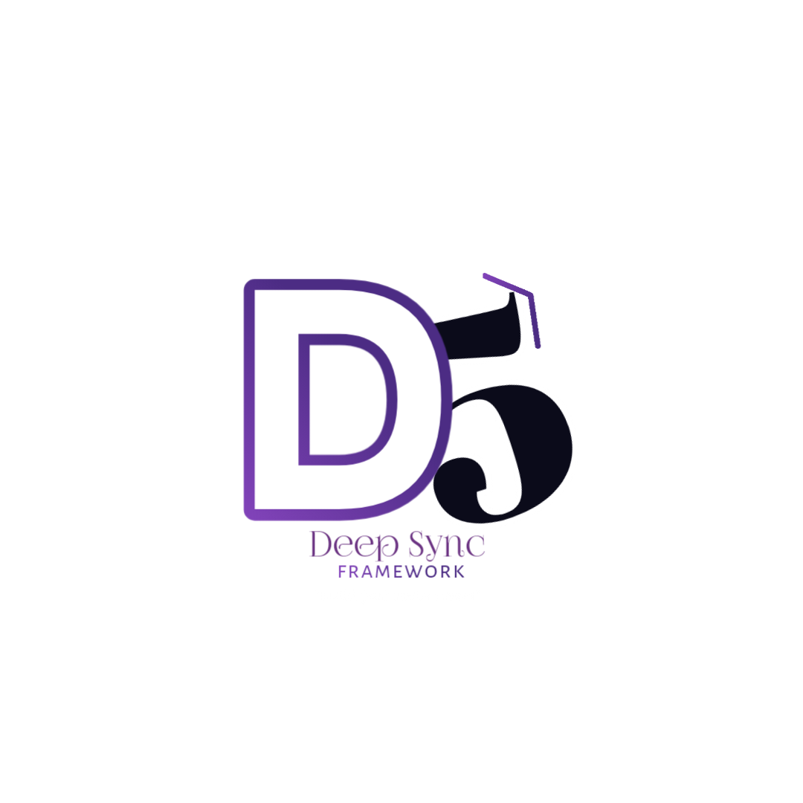

<p align="center">
  
</p>

# 🚀 Deep Sync Framework v5  

> ⚡ Lightweight • 🔥 Powerful • 🧠 Modern PHP Framework  
> Built with Core PHP + ORM + WebSockets  

---

## 🛡️ Badges  


---

## 📌 Overview  

**Deep Sync Framework v5** is a lightweight, Laravel-inspired PHP framework designed for speed, flexibility, and scalability.  

It provides a clean **MVC architecture**, powerful **ORM**, and **WebSockets support** for building modern real-time applications.

---

## 📄 License  

This project is licensed under the MIT License.

---

## ✨ Features  

### 🧱 Core Architecture  
- MVC structure (Model-View-Controller)  
- Clean & maintainable code  
- Modular system  
- Scalable design  

### 🗄️ Database & ORM  
- 🔥 Custom ORM (Active Record style)  
- Query Builder  
- No need for raw SQL  
- MySQL & SQLite support  
- Migrations

### 🔀 Routing System  
- Clean route definitions  
- Dynamic parameters  
- Route grouping  
- Middleware support  

### 🔌 Real-Time System  
- ⚡ WebSockets integration  
- Live chat systems  
- Real-time notifications  
- Event-driven architecture  

### ⚡ Performance  
- Lightweight core  
- Fast execution  
- Optimized routing  

### 🔐 Security  
- CSRF Protection  
- SQL Injection prevention  
- Input validation  

### 📡 API Support  
- RESTful APIs  
- JSON responses  
- API routing system  

### 📁 File Handling  
- File uploads  
- Storage system  
- Public/private access  

---

## 🆕 What's New in v5  

- 🔥 ORM System added  
- ⚡ WebSockets support  
- 🚀 Performance improved  
- 📁 Better structure  
- 🧠 Developer experience enhanced  

---

---

### 🌐 Verify Server Status

To check if your servers are running, use the following command:

php deep serve:status

| Service          | Status                                                                                                  |
| ---------------- | ------------------------------------------------------------------------------------------------------- |
| WebSocket Server |       |
| Redis Server     |   |

---

### 🧪 Available Commands 
| Command                                       | Description                                                  |
| --------------------------------------------- | ------------------------------------------------------------ |
| 🚀 `php deep serve`                           | Start the HTTP server                                        |
| 🌐 `php deep socket:serve`                    | Start the WebSocket server                                   |
| 🟥 `php deep redis:serve`                     | Start the Redis server                                       |
| 🧪 `php deep serve:status`                    | Check server status                                          |
| 🛠️ `php deep make:controller UserController` | Create a new controller                                      |
| 🛠️ `php deep make:model Post`                | Create a new model                                           |
| 🛡️ `php deep make:middleware Admin`          | Create a new middleware                                      |
| 🔔 `php deep make:channel Post`               | Create a new channel (`PostChannel`) **and auto-create its event (`PostEvent`)** |
| 🖼️ `php deep make:view posts.all`            | Create a new view                                            |
| 🗄️ `php deep make:migration posts`           | Create a new migration                                       |
| ⚡ `php deep make:command test`               | Create a new custom command                                  |
| 📦 `php deep migrate:install`                 | Install migrations table                                     |
| ⬆️ `php deep migrate`                         | Run migrations                                               |
| ⬇️ `php deep migrate:rollback`                | Rollback last migration                                      |
| 🔑 `php deep key:generate`                    | Generate a new app key                                       |
| 🗝️ `php deep app:key`                         | Generate a new app key                                       |

---

## 📂 Project Structure  

```bash
deep-sync-framework/
│
├── app/
│   ├── config/
│   ├── controllers/
│   ├── models/
│   ├── core/
│   ├── middleware/
│   ├── mail/
│   └── websockets/
│   
├── bootstrap/
├── view/
├── routes/
├── vendor/
├── public/
├── storage/
├── .env
---

## ⚙️ Installation  

# Clone the repository
git clone https://github.com/deepakgaikwad2044/deepsync.git

# Clone the repository
composer create-project deepakgaikwad2044/deepsync myapp

# Install dependencies
composer install

## 🚀 Run server
php deep serve

## 🔌 WebSocket Setup (Optional)

To enable realtime communication, start the Redis and Realtime server:

php deep redis:serve
php deep socket:serve

> This step is optional and only required for realtime (WebSocket) features.

---
## ⚠️ Known Issue & Fix

### ❌ Error

```bash
Fatal error: Uncaught Error: Class "React\\Cache\\ArrayCache" not found in vendor/react/dns/src/Resolver/Factory.php:78
```

> ⚡ This issue is common in fresh clones where Composer dependencies are not initialized.

---

### 🛠️ Solution

```bash
# Remove old dependencies
rm -rf vendor
rm composer.lock

# Clear Composer cache
composer clear-cache

# Install required packages
composer require react/dns react/cache

# Regenerate autoload files
composer dump-autoload
```

### 🧪 Verify Fix

```bash
php -r "require 'vendor/autoload.php'; new React\\Cache\\ArrayCache(); echo 'OK';"
```

### ✅ Expected Output

```bash
OK
```

---

## 💡 Troubleshooting

If the issue still persists:

```bash
composer install
```

---