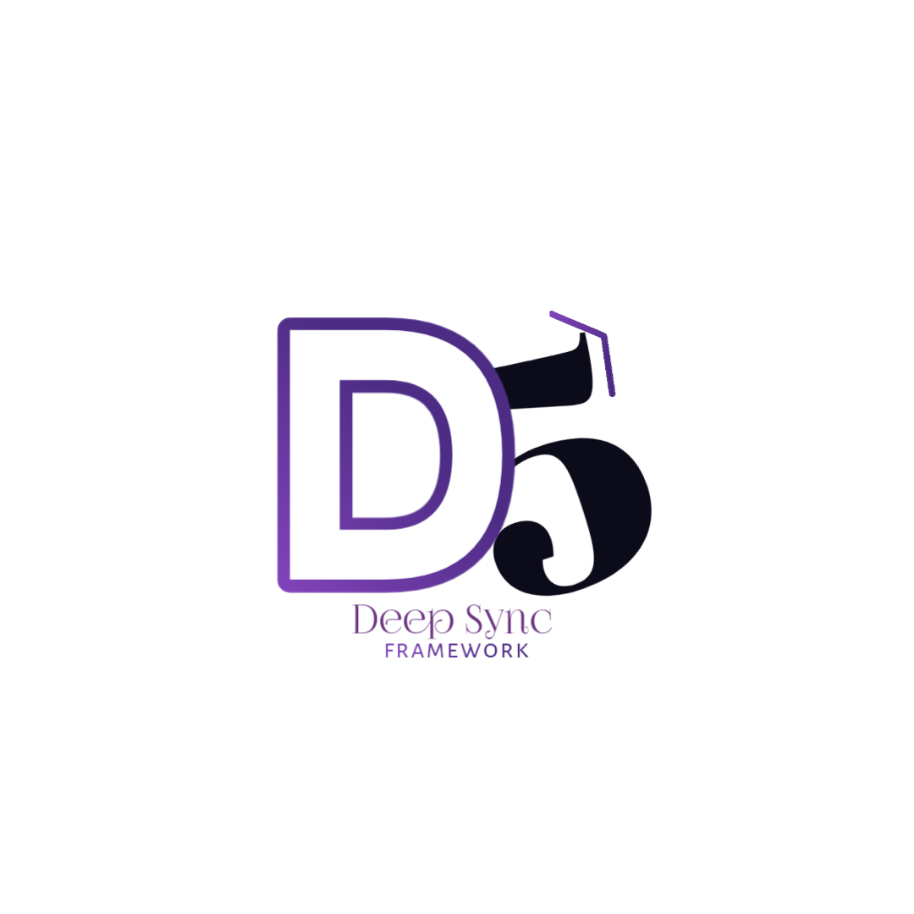

<p align="center">
  
</p>

<h1 align="center">🚀 Deep Sync Framework v5.0.3</h1>

<p align="center">
  <strong>⚡ Lightweight • 🔥 Powerful • 🧠 Modern PHP Framework</strong><br>
  Built with Core PHP • Custom ORM • PRANCHI Template Engine • WebSockets
</p>

<p align="center">
  <a href="#-features">Features</a> •
  <a href="#-installation">Installation</a> •
  <a href="#-cli-commands">CLI Commands</a> •
  <a href="#-project-structure">Structure</a> •
  <a href="#-websocket--realtime">Realtime</a>
</p>

---

## 🛡️ Badges


---

## 📌 Overview

**Deep Sync Framework v5.0.3** is a lightweight, Laravel-inspired PHP framework built from the ground up with **Core PHP**.

The framework focuses on providing a clean development experience while keeping the core lightweight and flexible.

It combines:

* 🧱 MVC architecture
* 🗄️ Custom ORM
* 🎨 PRANCHI Template Engine
* 🔀 Routing & Middleware
* 🔐 Security & Validation
* ⚡ WebSocket / Realtime support
* 🗃️ Migration system
* 📁 File storage & uploads
* 🛠️ Developer CLI
* 📚 Documentation system

> **Built for Speed. Designed for Scale.**

---

# ✨ Features

## 🧱 Core Architecture

* MVC architecture
* Modular application structure
* Clean and maintainable codebase
* Lightweight framework core
* Improved folder structure
* Developer-friendly architecture
* Reusable framework components

---

## 🗄️ Database & ORM

Deep Sync includes a custom ORM designed for simple and expressive database operations.

### ORM Features

* Active Record-style models
* Query Builder
* Model relationships
* `hasOne`
* `hasMany`
* `belongsTo`
* Foreign key support
* Migration system
* Database seeding
* MySQL support
* SQLite support
* SQL query protection

Example:

```php
$user = User::find(1);

$posts = $user->posts();

foreach ($posts as $post) {
    echo $post->title;
}
```

---

# 🎨 PRANCHI Template Engine

**PRANCHI** is the official template engine of Deep Sync Framework.

It provides Blade-inspired syntax while remaining integrated with the native PHP architecture of Deep Sync.

### PRANCHI Highlights

* Blade-like syntax
* Template inheritance
* Layout system
* Sections
* Includes
* Conditional directives
* Loops
* Escaped output
* CSRF directive
* XSS protection
* Template caching
* Reusable components
* Improved rendering system
* Better error handling

### Example

```php
@extends('layouts.app')

@section('content')

    <h1>{{ $title }}</h1>

    @if($users)

        @foreach($users as $user)
            <p>{{ $user->name }}</p>
        @endforeach

    @endif

@endsection
```

### PRANCHI Components

Deep Sync also provides a component-oriented approach for reusable UI elements.

```php
<x-button type="success">
    Save Data
</x-button>
```

---

# 🔀 Routing System

Deep Sync provides a clean routing system for web applications and APIs.

### Routing Features

* GET routes
* POST routes
* Dynamic parameters
* Route groups
* Middleware support
* Controller-based routing
* API routing
* Improved navigation handling

Example:

```php
Route::get('/users', [UserController::class, 'index']);

Route::get('/users/{id}', [UserController::class, 'show']);

Route::post('/users', [UserController::class, 'store']);
```

---

# 🛡️ Middleware

Middleware can be used to protect routes and control request processing.

Example:

```php
Route::middleware('auth')->group(function () {

    Route::get('/dashboard', [DashboardController::class, 'index']);

});
```

Use middleware for:

* Authentication
* Authorization
* CSRF protection
* Request filtering
* Access control
* Custom request processing

---

# 🔐 Security

Deep Sync Framework includes multiple layers of application security.

### Security Features

* 🛡️ CSRF protection
* 🔒 SQL injection protection
* 🧹 Input validation
* 🧼 XSS protection
* 🔐 Authentication middleware
* 🔑 Application key generation
* 🖼️ File/image validation
* 🔒 Permission and access control

---

# 📁 File Upload & Storage

The framework includes a storage system for handling uploaded files.

### Features

* File uploads
* Image validation
* Storage paths
* Public/private file handling
* Upload error handling
* Improved storage structure

Example validation:

```php
$request->validate([
    'image' => 'image'
]);
```

---

# ⚡ Realtime & WebSockets

Deep Sync Framework supports realtime communication through WebSockets.

This can be used for:

* 💬 Live chat
* 🔔 Realtime notifications
* 📡 Live updates
* ⚡ Event-driven applications
* 👥 Realtime user interactions

### Start Redis

```bash
php deep redis:serve
```

### Start WebSocket Server

```bash
php deep socket:serve
```

> WebSocket and Redis services are optional and are only required when using realtime features.

---

# 📡 API Support

Deep Sync can be used to build REST-style APIs.

Supported concepts include:

* API routes
* JSON responses
* Request validation
* Middleware
* Controller-based APIs
* Authentication
* Database integration

Example:

```php
return response()->json([
    'success' => true,
    'message' => 'User created successfully'
]);
```

---

# 🧰 Deep CLI

Deep Sync provides its own command-line tool:

```bash
php deep
```

The CLI helps developers generate application files and manage framework services.

---

# 🧪 CLI Commands

| Command                                   | Description                        |
| ----------------------------------------- | ---------------------------------- |
| `php deep serve`                          | Start the HTTP server              |
| `php deep serve:status`                   | Check server status                |
| `php deep socket:serve`                   | Start the WebSocket server         |
| `php deep redis:serve`                    | Start the Redis server             |
| `php deep make:controller UserController` | Create a controller                |
| `php deep make:model Post`                | Create a model                     |
| `php deep make:middleware Admin`          | Create middleware                  |
| `php deep make:channel Post`              | Create a channel and related event |
| `php deep make:view posts.all`            | Create a view                      |
| `php deep make:migration posts`           | Create a migration                 |
| `php deep make:command test`              | Create a custom command            |
| `php deep migrate:install`                | Install migration table            |
| `php deep migrate`                        | Run migrations                     |
| `php deep migrate:rollback`               | Roll back the latest migration     |
| `php deep migrate:status`                 | Check migration status             |
| `php deep key:generate`                   | Generate application key           |
| `php deep app:key`                        | Generate application key           |

---

# 🗃️ Migration System

Deep Sync includes a custom migration system for managing database structure.

### Install migrations

```bash
php deep migrate:install
```

### Create migration

```bash
php deep make:migration users
```

### Run migrations

```bash
php deep migrate
```

### Rollback

```bash
php deep migrate:rollback
```

### Check status

```bash
php deep migrate:status
```

---

# 🌱 Database Seeding

Deep Sync supports database seeding for development and initial application data.

Seeder functionality can be used to automatically populate application databases with required records.

---

# 🔑 Application Key

Generate an application key using:

```bash
php deep key:generate
```

or:

```bash
php deep app:key
```

---

# 📊 Server Status

You can check the status of framework services with:

```bash
php deep serve:status
```

Example:

| Service          | Status                                                                                    |
| ---------------- | ----------------------------------------------------------------------------------------- |
| WebSocket Server |    |
| Redis Server     |  |

> The displayed status depends on the services currently running on your system.

---

# 📂 Project Structure

```text
deep-sync-framework/
│
├── app/
│   ├── config/
│   ├── controllers/
│   ├── models/
│   ├── core/
│   ├── middleware/
│   ├── mail/
│   └── websockets/
│
├── bootstrap/
│   └── cache/
│
├── database/
│   ├── migrations/
│   └── seeders/
│
├── routes/
│
├── view/
│
├── public/
│
├── storage/
│
├── vendor/
│
├── .env
├── composer.json
└── deep
```

---

# ⚙️ Requirements

Before installing Deep Sync Framework, make sure your environment provides:

* PHP 8+
* Composer
* MySQL or SQLite
* Redis — optional
* WebSocket dependencies — optional for realtime applications

---

# 🚀 Installation

## 1. Clone the Repository

```bash
git clone https://github.com/deepakgaikwad2044/deepsync.git
```

```bash
cd deepsync
```

## 2. Install Dependencies

```bash
composer install
```

## 3. Configure Environment

Create/configure your `.env` file with your application and database configuration.

Example:

```env
APP_ENV=local
APP_KEY=

DB_CONNECTION=mysql
DB_HOST=127.0.0.1
DB_PORT=3306
DB_DATABASE=your_database
DB_USERNAME=your_username
DB_PASSWORD=your_password
```

## 4. Generate Application Key

```bash
php deep key:generate
```

## 5. Install Database Migrations

```bash
php deep migrate:install
```

## 6. Run Migrations

```bash
php deep migrate
```

## 7. Start the Application

```bash
php deep serve
```

Your application is now ready to run.

---

# 🔌 WebSocket Setup

If your application requires realtime communication:

### Start Redis

```bash
php deep redis:serve
```

### Start WebSocket Server

```bash
php deep socket:serve
```

You can check the service status with:

```bash
php deep serve:status
```

---

# 🧠 Developer Experience

Deep Sync v5.0.3 focuses heavily on improving the developer experience.

### Improvements include

* Cleaner folder structure
* Improved Blade-style templates
* PRANCHI template engine
* Template caching
* Better validation
* Improved authentication UI support
* Better file upload handling
* CSRF verification layer
* Improved navigation and layout system
* Documentation improvements
* ORM improvements
* Database relationship support
* Foreign key constraints
* Seeder improvements
* Developer CLI commands

---

# 🚀 v5.0.3 Highlights

Deep Sync Framework v5.0.3 builds on the v5 architecture with significant improvements across the framework.

### 🧱 Core Architecture Refactor

The framework structure has been reorganized to make the codebase cleaner, easier to maintain, and easier to extend.

### 🎨 PRANCHI Template Engine

The custom template engine now provides a more complete Blade-inspired development experience with:

* Template inheritance
* Layouts
* Directives
* Components
* Caching
* XSS-safe rendering
* Better error handling

### 🔐 Modern Authentication & Validation

Authentication-related UI and validation systems have been improved with better handling for:

* Login errors
* Password reset
* Validation messages
* CSRF verification
* Form feedback

### 📁 Smart File Upload System

The file handling system has been improved with:

* Better storage paths
* File validation
* Image validation rules
* Upload handling improvements
* Better error handling

### 🛡️ SQL Protection

The framework includes improved query protection and safer database interactions.

### 🗄️ Database Improvements

Database functionality has been enhanced with:

* ORM improvements
* Model relationships
* Foreign key constraints
* Migration improvements
* Seeder improvements
* Better database structure

### 🧭 UI & Navigation

Framework UI components and application navigation have also been improved:

* Sidenav updates
* Top navigation updates
* Overlay support
* Improved layouts
* Better navigation handling
* Authentication UI improvements

---

# 📚 Documentation

Deep Sync includes a documentation system intended to make framework features easier to understand and use.

Documentation covers areas such as:

* ORM
* Routing
* Controllers
* Models
* PRANCHI
* Middleware
* Validation
* Migrations
* CLI
* Realtime functionality

---

# 🧪 Troubleshooting

## React Cache Error

If you encounter:

```text
Fatal error: Uncaught Error:
Class "React\Cache\ArrayCache" not found
```

This can occur when Composer dependencies are incomplete or have not been properly initialized.

### Fix

Remove the existing dependencies:

```bash
rm -rf vendor
rm composer.lock
```

Clear the Composer cache:

```bash
composer clear-cache
```

Install the required packages:

```bash
composer require react/dns react/cache
```

Regenerate autoload files:

```bash
composer dump-autoload
```

### Verify

```bash
php -r "require 'vendor/autoload.php'; new React\Cache\ArrayCache(); echo 'OK';"
```

Expected output:

```text
OK
```

If the issue still persists:

```bash
composer install
```

---

# 🏗️ Framework Philosophy

Deep Sync Framework is built around a simple idea:

> **Keep the framework lightweight, but provide the tools required to build modern applications.**

Instead of forcing developers into a large ecosystem, Deep Sync aims to provide a flexible Core PHP foundation with modern framework capabilities.

### Core principles

**⚡ Speed**

Keep the framework lightweight and efficient.

**🧠 Simplicity**

Make common development tasks straightforward.

**🧩 Modularity**

Build features that can be extended and reused.

**🔐 Security**

Provide security features as part of the framework architecture.

**📈 Scalability**

Design the framework so applications can grow with it.

**👨‍💻 Developer Experience**

Reduce repetitive work through CLI tools, ORM, templates, components, and automation.

---

# 🛣️ Roadmap

Future development may include further improvements to:

* ORM capabilities
* Query Builder
* Realtime infrastructure
* PRANCHI components
* Developer tooling
* Documentation
* Performance
* Authentication
* API development
* Testing utilities
* Framework extensibility

---

# 🤝 Contributing

Contributions, suggestions, bug reports, and feature requests are welcome.

If you want to contribute:

```bash
git clone https://github.com/deepakgaikwad2044/deepsync.git
```

Create a feature branch:

```bash
git checkout -b feature/my-feature
```

Commit your changes:

```bash
git add .
git commit -m "feat: add my feature"
```

Push the branch:

```bash
git push origin feature/my-feature
```

Then open a Pull Request.

---

# 📄 License

Deep Sync Framework is open-source software licensed under the **MIT License**.

---

# ❤️ Deep Sync Framework

<p align="center">
  <strong>Deep Sync Framework v5.0.3</strong>
</p>

<p align="center">
  Built with ❤️ using Core PHP
</p>

<p align="center">
  ⚡ Built for Speed &nbsp; • &nbsp; 🧠 Designed for Developers &nbsp; • &nbsp; 🚀 Ready to Scale
</p>
